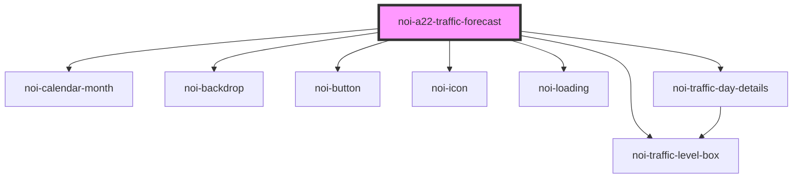

<!--
SPDX-FileCopyrightText: NOI Techpark <digital@noi.bz.it>

SPDX-License-Identifier: CC0-1.0
-->

# noi-traffic-prediction

<!-- Auto Generated Below -->

## Overview

Traffic forecast component

## Properties

| Property   | Attribute   | Description                                     | Type                                          | Default      |
| ---------- | ----------- | ----------------------------------------------- | --------------------------------------------- | ------------ |
| `language` | `language`  | Language                                        | `string`                                      | `'en'`       |
| `layout`   | `layout`    | Layout appearance                               | `"auto" \| "desktop" \| "mobile" \| "tablet"` | `'auto'`     |
| `location` | `location`  | Location                                        | `"Bolzano" \| "Brennero" \| "Verona"`         | `undefined`  |
| `viewDate` | `view-date` | View date (only month and year makes an impact) | `Date \| number \| string`                    | `new Date()` |

## Methods

### `changeViewMonth(change: number) => Promise<void>`

Change view month

#### Parameters

| Name     | Type     | Description                                                                                                            |
| -------- | -------- | ---------------------------------------------------------------------------------------------------------------------- |
| `change` | `number` | The number of months to shift the view. A positive value moves forward in time, while a negative value moves backward. |

#### Returns

Type: `Promise<void>`

### `resetToCurrentMonth() => Promise<void>`

Go back to current month

#### Returns

Type: `Promise<void>`

### `selectDay(day: Date | string | number | null) => Promise<void>`

Open day details

#### Parameters

| Name  | Type                       | Description |
| ----- | -------------------------- | ----------- |
| `day` | `string \| number \| Date` |             |

#### Returns

Type: `Promise<void>`

## Shadow Parts

| Part         | Description        |
| ------------ | ------------------ |
| `"calendar"` | Calendar           |
| `"footer"`   | Footer             |
| `"popup"`    | Day details dialog |
| `"title"`    | Title              |

## CSS Custom Properties

| Name                             | Description                     |
| -------------------------------- | ------------------------------- |
| `--busy-box-size`                | Size of the box                 |
| `--color-background`             | Background color                |
| `--color-background-shade`       | Background dark color           |
| `--color-border`                 | Border color                    |
| `--color-busy-critical`          | Critical traffic color          |
| `--color-busy-critical-contrast` | Critical traffic contrast color |
| `--color-busy-heavy`             | Heavy traffic color             |
| `--color-busy-heavy-contrast`    | Heavy traffic contrast color    |
| `--color-busy-regular`           | Regular traffic color           |
| `--color-busy-regular-contrast`  | Regular traffic contrast color  |
| `--color-busy-severe`            | Severe traffic color            |
| `--color-busy-severe-contrast`   | Severe traffic contrast color   |
| `--color-footer`                 | Footer color                    |
| `--color-footer-contrast`        | Footer contrast color           |
| `--color-primary`                | Primary color                   |
| `--color-primary-rgb`            | Primary color in RGB format     |
| `--color-secondary`              | Secondary color                 |
| `--color-secondary-rgb`          | Secondary color in RGB format   |
| `--color-text`                   | Text color                      |

## Dependencies

### Depends on

- [noi-calendar-month](../blocks/calendar-month)
- [noi-backdrop](../blocks/backdrop)
- [noi-button](../blocks/button)
- [noi-traffic-level-box](./partials/level-box)
- [noi-icon](../blocks/icon)
- [noi-loading](../blocks/loading)
- [noi-traffic-day-details](./partials/day-details)

### Graph

----------------------------------------------

*Built with [StencilJS](https://stenciljs.com/)*
