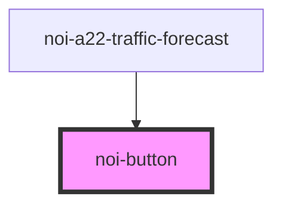

<!--
SPDX-FileCopyrightText: NOI Techpark <digital@noi.bz.it>

SPDX-License-Identifier: CC0-1.0
-->

# noi-button

<!-- Auto Generated Below -->

## Overview

(INTERNAL) Backdrop component.

## Properties

| Property   | Attribute   | Description                                                                                      | Type      | Default |
| ---------- | ----------- | ------------------------------------------------------------------------------------------------ | --------- | ------- |
| `disabled` | `disabled`  | button 'disabled' property                                                                       | `boolean` | `false` |
| `iconOnly` | `icon-only` | icon-only buttons has circle shape. The size of the button can be changed with "font-size" style | `boolean` | `false` |

## Events

| Event      | Description                            | Type                      |
| ---------- | -------------------------------------- | ------------------------- |
| `btnClick` | Emitted when user clicks on the button | `CustomEvent<MouseEvent>` |

## Shadow Parts

| Part              | Description   |
| ----------------- | ------------- |
| `"button-native"` | Native button |

## CSS Custom Properties

| Name               | Description                  |
| ------------------ | ---------------------------- |
| `--color`          | Text color                   |
| `--color-bg-hover` | Background hover color (rgb) |
| `--color-hover`    | Background hover color (rgb) |

## Dependencies

### Used by

 - [noi-a22-traffic-forecast](../../a22-traffic-forecast)

### Graph

----------------------------------------------

*Built with [StencilJS](https://stenciljs.com/)*
